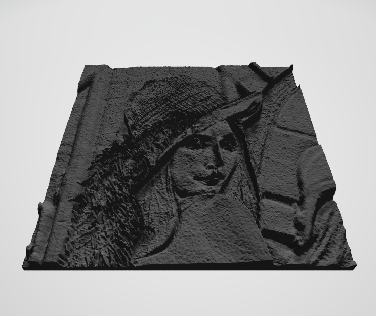

# image2stl-python
Easy to use solution to convert a 2d image into an stl file.
All you need is opencv to load the image and numpy-stl to handle the mesh.

# Installation
You need the following packages:
- [opencv](https://pypi.org/project/opencv-python/)
- [numpy](https://numpy.org/install/)
- [numpy-stl](https://pypi.org/project/numpy-stl/)

# Examples
- To generate a stl file from an rgb image.
```bash
python img2stl.py --img_path images/Lenna.png --save_path stl/Lenna.stl
python img2stl.py --img_path images/Lenna.png --save_path stl/Lenna.stl --scale_size 3 --z_res 0.3
python img2stl.py --img_path images/Lenna.png--save_path stl/Lenna.stl --scale_size 3 --nb_levels 100 --base_depth 10 --z_res 0.3 --xy_res 0.8 
```
Only the arguments `img_path` and `save_path` are mandatory. 

- For more parameters, look at the help.
```bash
python img2stl.py --help
```

# Result

 Input Image | Output STL 
 --- | --- 
 | 
